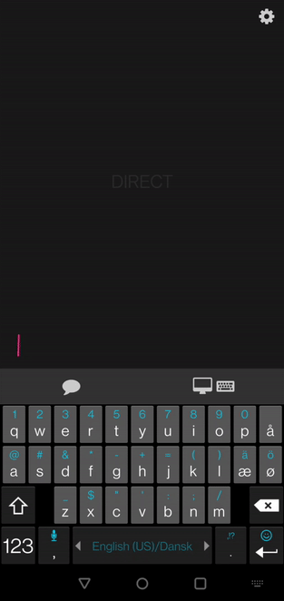
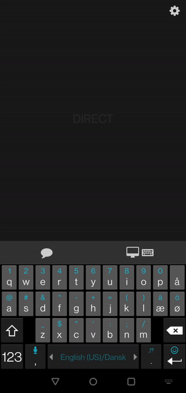
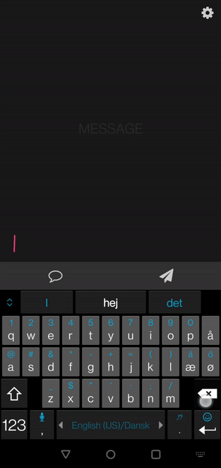

**I'm developing a new PointZ app with MAUI, this is an older version made with Xamarin.**

# FAQ

### What is PointZ?

PointZ is an Android/<s>iOS</s> (coming in the future) application built using Xamarin.Forms. The application allows you to emulate mouse and keyboard on any system running PointZerver, as long as they're on the same Wi-Fi network. 

### What is PointZerver?

PointZerver is a desktop application built using .NET 5.0. PointZerver, as the name suggests, is the server that interfaces with PointZ, and must be running on a compatible system for PointZ to work.

### Which operating systems are compatible with PointZerver ?

Since PointZerver is built using .NET 5.0, it can be compiled to **Windows**, **macOS** and **Linux**.

<u>*However, it's not currently being worked on for **iOS** or **macOS***</u>

### Is PointZ on Google Play and App store?

No. Maybe in the future, but I'd rather upload releases here on GitHub.

### Is  PointZ free?

PointZ is free and open-source.

# Installation Guide

1. Download PointZerver to the PC you want to remote control
2. Download PointZ to your mobile device
3. Run PointZerver
4. Run PointZ

# Get started

<table>
    <tr>
        <th width="33.33%"></th>
        <th width="33.33%"></th>
        <th width="33.33%"></th>
    </tr>
    <tr>
        <td align="center">While PointZ is running it'll listen for any computers on the local network.</td>
        <td align="center"> When a PC is found, a remote control session can begin.</td>
        <td align="center">Phone/Keyboard button illustrates the software keyboard, tap it to open it up.</td>
    </tr>
	<tr>
    	<th width="33.33%"></th>
    	<th width="33.33%"></th>
        <th width="33.33%"></th>
	</tr>
    <tr>
   		<td >The PC/Keyboard button illustrates a hardware keyboard, tap it to open media- and other useful 									hardware keys.</td>
    	<td >Tap the chatbubble logo to toggle between direct- or message-mode.</td>
        <td >Tap the paper plane icon to send the message.</td>
    </tr>
</table>

- Direct Mode (default): Instantly sends the character tapped (text-prediction, grammar correct and other features are disabled.)
- Message Mode: Input behaves chat-like.

# How to use

### Mouse

| Button           | Mouse Action | Touch Action | Finger Count | Sequence              | Condition                                                    | Time  |
| ---------------- | ------------ | ------------ | ------------ | --------------------- | ------------------------------------------------------------ | ----- |
| Primary Button   | Click        | Tap          | 1            | Down, up              | Single tap without movement. Happens after:                  | 200ms |
| Primary Button   | Hold         | Tap and hold | 1            | Down, up, down (hold) | Time between a tap and putting the finger down again is within: | 200ms |
| Primary Button   | Double click | Double tap   | 1            | Down, up, Down, up    | Two taps in a row. Time between the first and second tap must be within: | 200ms |
| Secondary Button | Click        | Multi-tap    | 2            | Down, up              | Single tap with two fingers. Happens instantly.              | 0ms   |
| Middle Button    | Click        | Multi-tap    | 3            | Down, up              | Single tap with three fingers. Happens instantly.            | 0ms   |
| Mouse wheel      | Scroll       | Hold         | 2            | Down (hold)           | Hold with two fingers. Moving fingers up scrolls down and vice versa. | 0ms   |

### Keyboard

1. Click on the text box placed at the bottom of the screen.
2. When the text  box is focused, you are free to type whatever you want
3. Press the enter button on the soft-keyboard to send the message.

While the text box is empty, commands such as backspace and enter (new line) are sent to PointZerver immediately.

# Current Version

**BE AWARE THAT THIS APPLICATION IS CURRENTLY IN ITS EARLY STAGES AND FUNCTIONALITY IS LIMITED.**

| Application | Version | Phase |
| ----------- | ------- | ----- |
| PointZ      | V0.3.2  | Alpha |
| PointZerver | V0.1.5  | Alpha |

# Download

### PointZ

[Android](Releases/PointZ/Android/sunflowerSensei.PointZ.apk.7z)

### PointZerver

[Windows](Releases/PointZerver/Windows/win-x64.7z)

# Troubleshooting

### PointZ isn't discovering my PC

**First of all, ensure that the mobile device running PointZ and the PC running PointZerver are on the same Wi-Fi-network.**

PointZerver constantly broadcasts UDP packets for the clients running PointZ to pick up. These broadcast messages might be blocked by a firewall on the network.

Below is a table of all ports and protocols used by PointZ and PointZerver.

## Ports used

| Application | Port     | Protocol | Role             |
| ----------- | ----- | -------- | ---------------- |
| PointZ      | 45455 | UDP      | Listener         |
| PointZerver | 45454 | UDP      | Command Receiver |
