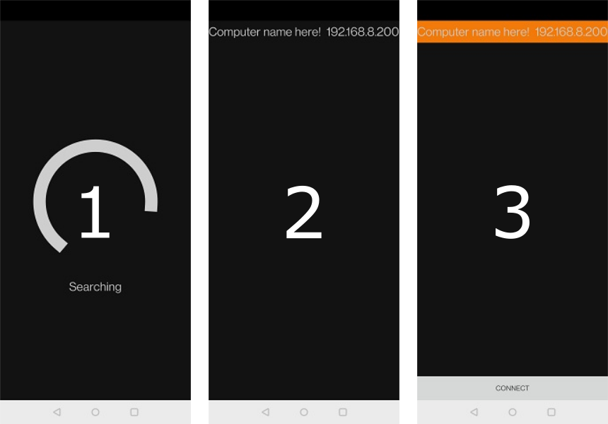

# FAQ

### What is PointZ?

PointZ is an Android/<s>iPhone</s> (coming in the future) application built using Xamarin.Forms. The application allows you to emulate mouse and keyboard on any system running PointZerver, as long as they're on the same Wi-Fi network. 

### What is PointZerver?

PointZerver is a desktop application built using .NET 5.0. PointZerver, as the name suggests, is the server that interfaces with PointZ, and must be running on a compatible system for PointZ to work.

### Which operating systems are compatible with PointZerver ?

Since PointZerver is built using .NET 5.0, it can be compiled to **Windows**, **macOS** and **Linux**.

<u>*However, it's not currently being worked on for **iOS** or **macOS***</u>

### Is PointZ on Google Play and App store?

No. Maybe in the future, but I'd rather upload releases here on GitLab.

### Is  PointZ free?

PointZ is free and open-source.

# Installation Guide

1. Download PointZerver to the PC you want to remote control
2. Download PointZ to your mobile device
3. Run PointZerver
4. Run PointZ

# Get started

1. When PointZ is running, it'll immediately enter "Discovery mode", listening for any PointZerver applications on the network. 
2. When PointZerver and PointZ runs simultaneously, PointZ will list all available devices.
3. When you tap on the device you want to remote control, a **connect** button appears at the bottom of the screen.

Click **connect** and remote control the selected device!

# How to use

### Mouse

| Button           | Mouse Action | Touch Action | Finger Count | Sequence              | Condition                                                    | Time  |
| ---------------- | ------------ | ------------ | ------------ | --------------------- | ------------------------------------------------------------ | ----- |
| Primary Button   | Click        | Tap          | 1            | Down, up              | Single tap without movement. Happens after:                  | 200ms |
| Primary Button   | Hold         | Tap and hold | 1            | Down, up, down (hold) | Time between a tap and putting the finger down again is within: | 200ms |
| Primary Button   | Double click | Double tap   | 1            | Down, up, Down, up    | Two taps in a row. Time between the first and second tap must be within: | 200ms |
| Secondary Button | Click        | Multi-tap    | 2            | Down, up              | Single tap with two fingers. Happens instantly.              | 0ms   |
| Middle Button    | Click        | Multi-tap    | 3            | Down, up              | Single tap with three fingers. Happens instantly.            | 0ms   |
| Mouse wheel      | Scroll       | Hold         | 2            | Down (hold)           | Hold with two fingers. Moving fingers up scrolls down and vice versa. | 0ms   |

### Keyboard

1. Click on the text box placed at the bottom of the screen.
2. When the text  box is focused, you are free to type whatever you want
3. Press the enter button on the soft-keyboard to send the message.

While the text box is empty, commands such as backspace and enter (new line) are sent to PointZerver immediately.

# Current Version

**BE AWARE THAT THIS APPLICATION IS CURRENTLY IN ITS EARLY STAGES AND FUNCTIONALITY IS LIMITED.**

| Application | Version | Phase |
| ----------- | ------- | ----- |
| PointZ      | V0.3.0  | Alpha |
| PointZerver | V0.1.4  | Alpha |

# Download

### PointZ

https://drive.google.com/drive/folders/1Wb_Bz7FsOtTk9ZraFRQ9Ve7e_yYNw8HR

### PointZerver

https://drive.google.com/drive/folders/1E1ca5ZQqQigOoMo5ikrgok3YpFGECbMH

# Troubleshooting

### PointZ isn't discovering my PC

**First of all, ensure that the mobile device running PointZ and the PC running PointZerver are on the same Wi-Fi-network.**

PointZerver constantly broadcasts UDP packets for the clients running PointZ to pick up. These broadcast messages might be blocked by a firewall on the network.

Below is a table of all ports and protocols used by PointZ and PointZerver.

## Ports used

| Application | Port     | Protocol | Role             |
| ----------- | ----- | -------- | ---------------- |
| PointZ      | 45455 | UDP      | Listener         |
| PointZerver | 45454 | UDP      | Command Receiver |

# Changelog

### PointZ

| Version | Changes                                                      |
| ------- | ------------------------------------------------------------ |
| 0.1     | Alpha Release                                                |
| 0.1.1   | - Mouse up command is no longer send if **Secondary Button Click** has been performed after engaging **Primary Button Hold** - Scrolling no longer jumps randomly |
| 0.2.0   | - Keyboard added - Replaced bottom bar with text-input  |
| 0.2.1   | - Tap and hold now works correctly - Textbox can no longer be clicked through - Touch and key events no longer break when leaving/reentering activity |
| 0.3.0   | Reworked touch-to-mouse code                                 |

### PointZerver

| Version | Changes                                                      |
| ------- | ------------------------------------------------------------ |
| 0.1     | Alpha Release                                                |
| 0.1.1   | Adjusted keyboard interpretation (when receiving data from PointZ). |
| 0.1.2   | Fixed data interpreter incorrectly deserializing payloads containing commas |
| 0.1.3   | No longer binds to virtual network interfaces.               |
| 0.1.4   | Minor code-refactor                                          |

